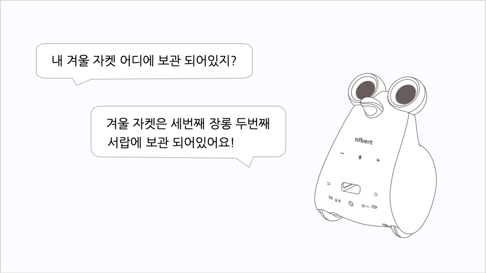

# Mobile App 으로 간편하게 나만의 음성 명령(질문)과 답변 등록하기 
NUGU Mobile App에서 나만의 음성 명령을 등록하여 로봇에서 즉시 확인할 수 있습니다.

- My Q&A 특징
  - NUGU 앱의 My Q&A 메뉴를 사용하여 질문과 답변 시나리오를 자유롭게 등록할 수 있습니다.
  - 사전에 등록한 질문을 albert AI 디바이스에 음성 명령하시면 지정된 답변이 음성으로 송출됩니다.
  - 질문은 최대 30개를 등록할 수 있으며, 답변은 질문 하나당 최대 30개까지 등록할 수 있습니다. 여러 개의 답변이 등록되어 있는 경우에는 랜덤하게 발화합니다.

- 사용방법
   

- 주의사항
  - NUGU에서 제공 중인 서비스의 대표 음성 명령문을 질문으로 등록할 경우 이용에 제한이 발생할 수 있습니다.
  - 질문에 대한 답변이 음성으로 안내되므로 개인 정보 및 금융 정보 등 보안이 필요한 내용은 입력하지 않는 것이 좋습니다.
  - 질문과 답변에 비속어, 욕설, 선정성 문구 등은 입력이 제한됩니다.
  - 질문과 답변을 저장한 후 학습할 시간이 필요합니다. 다소 지연되더라도 조금만 기다려 주세요.
  - My Q&A는 NUGU 앱 1.4.0 버전부터 지원합니다.
